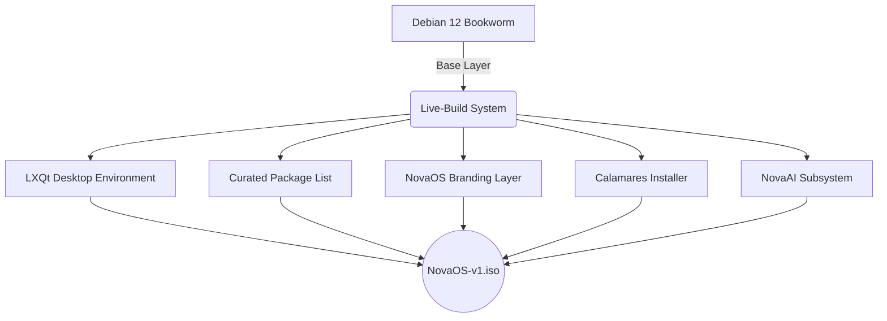

<div align="center">
  <h1>NovaOS</h1>
  <p><b>A lightweight, pre-configured Debian-based Linux distribution optimized for developers and learners.</b></p>

  <!-- Badges -->
  <p>
    <a href="https://debian.org"></a>
    <a href="https://lxqt-project.org/"></a>
    <a href="https://ollama.com/"></a>
    
  </p>
</div>

<hr />

## Table of Contents
- [Overview](#overview)
- [Key Features](#key-features)
- [Architecture](#architecture)
- [Getting Started](#getting-started)
- [Development Workflow](#development-workflow)
- [Documentation & Resources](#documentation--resources)

---

## Overview

Modern operating systems and Integrated Development Environments (IDEs) often struggle to run smoothly on legacy hardware. Furthermore, setting up a comprehensive development environment from scratch can be a time-consuming and error-prone process.

**NovaOS** is engineered to resolve these friction points. Built on top of a stable Debian foundation, it is designed to boot rapidly on older hardware (2GB–8GB RAM) and comes pre-loaded with essential development tools and an offline AI assistant. NovaOS is ready for immediate use upon installation, requiring zero configuration and maintaining full functionality without an active internet connection.

---

## Key Features

- **Resource Efficiency:** Utilizes the lightweight LXQt desktop environment, consuming under 450MB of RAM at idle.
- **Out-of-the-Box Development:** Pre-installed and configured with essential programming tools, including C/C++ compilers, Java, Python, and Git.
- **Integrated Offline AI:** Features **NovaAI**, a built-in terminal-based assistant powered by Ollama and TinyLlama. Optimized to run locally on systems with as little as 2GB RAM.
- **Zero-Setup Philosophy:** Designed so users can boot the system and begin coding immediately without any prior environment configuration.

---

## Architecture

NovaOS leverages Debian's robust `live-build` system to assemble a custom image.



---

## Getting Started

### Prerequisites
- A Debian or Ubuntu-based host system (required only for building the ISO).
- Git installed on your host machine.

### Local Setup

To begin contributing to NovaOS, follow these setup instructions:

```bash
# 1. Clone the repository
git clone <your-repo-url> novaos
cd novaos

# 2. Check out your assigned working branch
git checkout -b <your-feature-branch>

# 3. Push the branch to the remote repository
git push -u origin <your-feature-branch>
```

---

## Development Workflow

We follow a strict branching strategy to ensure the stability of the primary build.

- **`main` Branch:** The definitive source of truth. It must remain buildable at all times.
- **Feature Branches:** All active development occurs on individual branches (e.g., `person1-build`, `person2-desktop`, `person3-ai`).

### Weekly Synchronization Protocol

To manage integration, the team adheres to a structured weekly merge process:

1. **Pull and Rebase:** Fetch the latest changes from `main` and resolve any local conflicts on your feature branch.
2. **Verification:** 
   - *Core Build:* Run `lb build` to verify ISO compilation.
   - *Subsystems:* Verify that configurations (Desktop, AI) apply cleanly.
3. **Sequential Merge:** Merge branches into `main` in the following strict order:
   - **Phase 1:** Core Foundation (Build system, package lists)
   - **Phase 2:** Desktop Environment & UI
   - **Phase 3:** AI Integration & Auxiliary Tools
4. **Failure Protocol:** If a build fails during testing, **do not merge**. Fix the issues on the feature branch first. Never force-push to the `main` branch.

---

## Documentation & Resources

For detailed project specifications and task breakdowns, please refer to the following internal documents:

- [Product & Technical Requirements Document (PRD/TRD)](docs/PRD_TRD.md)
- [Task Division & Responsibilities](docs/TASK_DIVISION.md)
- [AI Prompts & Guidelines](docs/AI_PROMPTS.md)
- [Checkpoint & Progress Tracker](docs/WEEK4_CHECKPOINT.md)

<hr />

<div align="center">
  <small>&copy; NovaOS Development Team. Built for Developers and Learners.</small>
</div>
